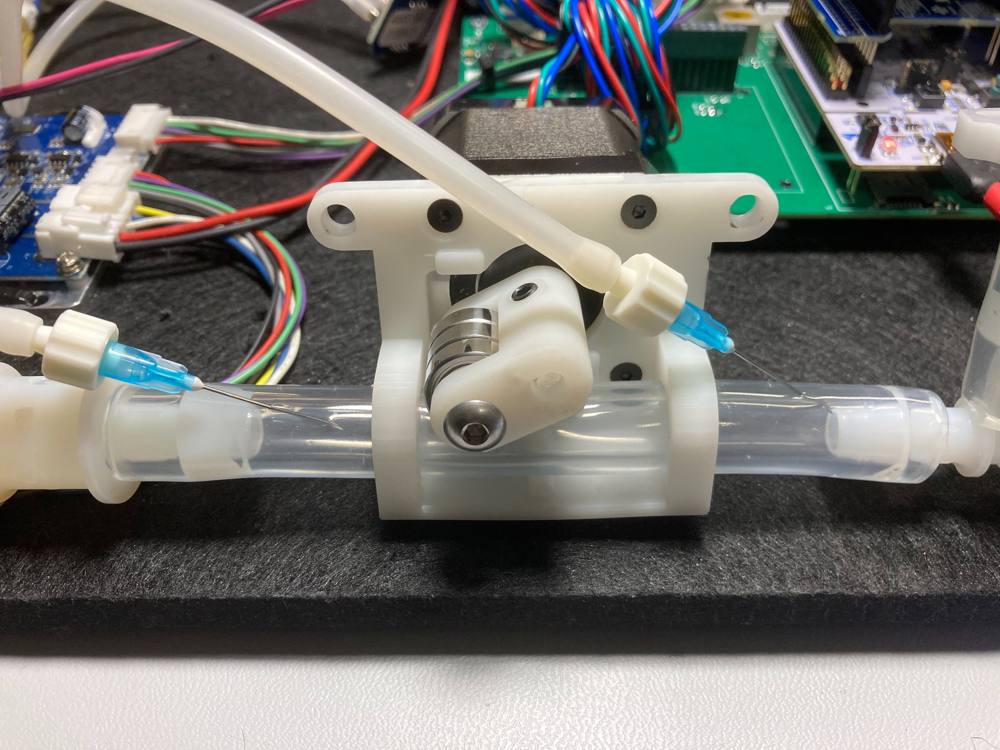

# pcbreathe-bringup
bringup code for RespiraWorks Ventilator Mainboard Rev 1.0

make sure to check the pcbreathe repo for quick start quide and board hardware errata: [https://github.com/RespiraWorks/pcbreathe](https://github.com/RespiraWorks/pcbreathe)

for unofficial (proceed at your own risk!) test code with a state machine for running a ventilator setup in closed-loop control mode, see: [https://github.com/inceptionev/FMLtest](https://github.com/inceptionev/FMLtest)

## Quick notes
* This version is coded without wait states to work with any combination of peripherals.  You do not need to have everything plugged in to make it work.
* However, this means that the cycle time may vary depending on what peripherals are populated.  Comment out parts as needed if they are slowing things down.
    * At minimum the STM32 Nucleo is required.  It will just output info to USB serial.
    * With the PCB added, it will beep the buzzer and flash the RED LED on the backside of the PCB.
    * With the uSD card plugged in, it will run read info from the SD card and publish to USB serial.
    * Alternates actuating the heater and solenoid
    * Drives i2c SSD1306 display on any of the 4 PCB ports for i2c testing
    * One or two X-NUCLEO-IHM03A1 stepper driver modules, values in this code are selected for driving Marc-designed pinch valves, but will just spin any stepper motor for testing.  Look up the X-NUCLEO-IHM03A1 user guide to configure the hardware for stacking.  You'll have to solder some resistors.
    * With the Rpi populated, it will send sensor data to the Rpi over serial and echo back the last character received from the Rpi UART.
* If you want to use this for capturing serial data out, you may need to comment or uncomment some of the sections at the bottom of the code for Cypress or Arduino serial formatting.  It indicates in code which blocks apply.  
* You will need to install some dependencies to use the code, which is also documented at the bottom of this readme, in the section titled "STM32duino setup".  

## How to use this test:
* Follow the instructions on the https://github.com/RespiraWorks/pcbreathe readme if you need help getting the hardware set up, where to plug things in, etc.
* Follow the instructions at the bottom of this readme under the STM32duino setup section to get program the Nucleo.  Remember to switch JP5 to the E5V position if you have the STM32 Nucelo populated onto the PCB.
* Insert a FAT32-formatted micro SD card into the cycle controller SD card slot on the PCB.
* Connect representative loads to the heater and solenoid switch outputs on the PCB.  Pick something like a solenoid that will respond visually or audibly.
* To test i2c, connect a representative i2c device (the code is written for an [SSD1306 OLED display](https://www.amazon.com/gp/product/B07RKPSHRK)) to one or all of the i2c sensor ports.
* Connected one or two X-NUCLEO-IHM03A1, along with stepper motors, referring to the https://github.com/RespiraWorks/pcbreathe readme if needed.  If you use more than stepper driver stacked, consult the X-NUCLEO-IHM03A1 user guide to make the required modifications.
* Program the board.
* Open the serial monitor and set it to 115200 baud (or whatever you've in the code below)
* Press reset to run the SD card test at the beginning, followed by the hardware cycling test
* The following behaviors are expected on a functioning board:
    * The serial monitor should display valid information about the SD card.
    * Red light on the bottom blinks (Green and Yellow LEDs do not work on Rev 1.0 due to a pin conflict)
    * Buzzer will beep softly on every cycle.  If you can't hear it over whatever loads (blower, solenoid) you have connected, increase the volume in the defines below.
    * The blower will turn on and cycle between the two power levels set at the top of the code.
    * The loads you plugged in will alternate activating
    * The stepper motors will alternate to open and closed posistions (about 90deg of motion on 17HS19-2004S2 stepper motors)
    * The serial console will stream the three pressure sensor readings of the dP sensors, the vsense, and the last chactacter received from Rpi via the UART connection - in the order of patient pressure, inhalation, exhalation, vsense, Rpi character.
    * If you have i2c oled displays hooked up, they will also display this data, along with their port number.  (note that you cannot pull out the OLED display and move it between ports while the program is live to test all the ports.  To do this you must reset the STM32 each time so that the display initializes correctly)
    * Gently press your finger over the positive port of each of the dP sensors and you should see each reading go up slightly in turn.
	* The MPXV5004DPs come out as 14bit values and the scaling is ```kPa = 5*Value/16383-1```.
    * The expected value for vsense is about 13024 for 12.0V input (expect 12480-13600 for 11.5-12.5V)
    * If you have an Rpi connected, open up a serial terminal on the Rpi such as minicom (you may have to disable serial console and enable serial port in Rpi Config)
    * Set the terminal to 115200 8N1, no flow control.
    * Observe that you see the same data here (3x dP readings, vsense, last char received)
    * Hold down a key on the Pi to transmit characters and see that the last char received echoes it back.
    

## STM32duino setup
* To use this code, you will need to setup the Arduino IDE to talk to STM32.  Use this link for instructions: [http://www.emcu.eu/2017/03/13/how-to-use-stm32-and-arduino-ide/](http://www.emcu.eu/2017/03/13/how-to-use-stm32-and-arduino-ide/) 
* To program this board, you will need to go to Tools... and select the following
    * Board: Nucleo-64
    * Board part number: L452RE
    * Upload method: Mass Storage
    * Port: [select the com port where you computer assigned the Nucleo]
    * other settings can be left on their defaults.
* Further dependencies.  You will also need to install the following packages to run this code (install by going to Tools...Manage Libraries... in your Arduino IDE and seaching for the below):
  * Adafruit SDD1306
  * Adafruit GFX
  * [powerSTEP01 arduino library](https://github.com/Megunolink/powerSTEP01_Arduino_Library) (may require manual install: follow the directions in the readme of the library.) 
  * some folks have reported issues with the Mass Storage programming method (not enough space error).  Here are a couple things to try:
  * make sure you have the latest version of the Arduino IDE and the STM32duino board package (first link in this section up abobe).
  * If that doesn't work the "STM32CubeProgrammer (SWD)" programming option will almost certainly work.  However, to use the SWD mode you will need to download and install the [STM32CubeProgrammer](https://www.st.com/content/st_com/en/products/development-tools/software-development-tools/stm32-software-development-tools/stm32-programmers/stm32cubeprog.html#overview)


## GETTING DATA OUT:
Outputs can be plotted and exported with Cypress PSoC Programmer (Bridge Control Panel Tool)

* Download and install, connect serial
* Tools > Protocol Configuration > serial 115200:8n1 > hit OK
* In the editor tab, use this command:

    ```RX8 [h=43] @1Key1 @0Key1 @1Key2 @0Key2 @1Key3 @0Key3 @1Key4 @0Key4 @1Key5 @0Key5 ```
* In order, each of these outputs is: Time(ms), Pressure dP, Inhale dP, Exhale dP, Input Voltage Sense
* The MPXV5004DPs come out as 14bit values and the scaling is ```kPa = 5*Value/16383-1```.
* The MPXV5004DP sensors are assigned to Pressure, Inhale, and Exhale on this board, but of course you can connect them to anything you want to measure
* The hypodermic needles can be useful for picking off pressures anywhere you have rubber tubing.
* Be careful not to poke yourself.
* Watch out for dynamic pressure effects when using the needles.  I have found better results by inserting the needle at an acute angle to the flow, pointing downstream, and retracting the needle such that the opening is near the sidewall of the hose.


* Chart > Variable Settings
* Tick Key1 through Key5, configure as int, and choose colors > hit OK
* Press >|< icon to connect to com port if necessary
* Click REPEAT button, go to Chart tab  
* both traces should now be plotting
* Click STOP button to stop recording.
* Chart > Export Collected Data in the format of your choice.  Note that this method captures a maximum of 10,000 samples.  It will clip the beginning of your experiment if it is longer than 10k samples.
* You can run longer experiments within the 10k sample limit by increasing CONTROL_PERIOD, which will reduce the sampling rate.
* If you need more than 10k samples use a different logger (or use the TO FILE button instead of REPEAT, it will output hex data that you can copy-and-paste, so be prepared to do some post-processing)
